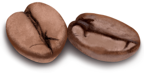

<p align="center">
  
</p>
<p align="center">
  <strong><a href="#quickstart">Quick Start</a> | <a href="#development">Development</a> </strong>
</p>

# mjavac
## A parser and compiler for MiniJava, with extensions

<a id="quickstart"></a>
## Quick Start

This project holds modules which together build up mjavac - a MiniJava compiler (with extensions).

Each part is self-contained and reusable. For example, the parser may be used as a library to build syntax highlighters, interpreters and so on. The parser library is used by mjavac to build an AST for the source code.

The top-level project builds the complete compiler.

```sh
make build
./build/mjavac test/examples/factorial.java
```

## Table of contents

[Quickstart](#quickstart)<br/>
[Features](#features)<br />
[Documention](#documentation)<br />
[Documentation - mjavac](#documentation-mjavac)<br />
[Documentation - Parser](#documentation-parser)<br />
[Development](#development)

## Features

* Reusable parser library
* Helpful error messages with GCC-like reporting
* Can be built with included Graphviz support for parse graphs
* Flags for validating syntax and or semantics only - usable for CI

<a id="documentation"></a>
## Documentation

_Note_: allthough every project is able to be built and used in isolation, it may require additional configuration. The compiler flags in each project represent a bare minimum and are supposed to be tuned, such as is done by the main project's Makefile. To compile the projects in their simplest form simply ensure that `$CXXFLAGS` contains at least `-std=c++17` like so: `CXXFLAGS=-std=c++17 make -C ...`. The projects can be built in debug mode by setting the `DEBUG` environment variable like so: `DEBUG=true ...`. However, the debug mode provided by using the main Makefile is much more powerful as it uses Address Sanitizers etc.

<a id="documentation-mjavac"></a>
### mjavac (CLI)

The mjavac project is the complete tool made available in this project. It combines the parser, compiler and more and provides a complete tool for dealing with MiniJava files.

The simplest way to build the CLI is to run `make mjavac`. It can be built by itself just like other projects, but it generally makes little sense. Just like with the parser, simply run `make -C mjavac` to build.

The resulting binary will be available in the `mjavac/build` directory under the chosen build configuration (`production`, `debug`).

#### Usage

To get usage information, simply run `mjavac --help`. Depending on what features were included in your build, you'll get the output shown below.

```
OVERVIEW:  MiniJava compiler with extensions

USAGE: mjavac [options] file

OPTIONS:

-h, --help                     Print this help page
--parse-only                   Only parse the source
--semantics-only               Only validate the semantics of the source
--execute                      Execute the source
--dot <file.dot>               Output a dot-formatted parse graph
--graph <file.(pdf|png|jpg)>   Render the parse graph as a pdf
--symbol-table <file.txt>      Output the symbol table
```

There are four main usages of the mjavac tool - to parse, check semantics, compile or execute a program.

```sh
# Parse, analyze semantics and compile a source file
mjavac source.java

# Only validate the syntax of a source file
mjavac --parser source.java

# Parse and validate the semantics of a source file
mjavac --semantics-only source.java

# Parse, validate semantics and execute a source file
mjavac --execute source.java
```

During the parsing phase, mjavac will check for the following flags:

* `--dot <file.dot>` - write a parse tree to `file.dot` in the Graphviz dot format
* `--graph <file.(pdf|png|jpg)>` - render the parse tree to `file` in the specified format
* `--parse-only` - terminate immediately after the parsing phase

During the semantics check, mjavac will check for the following flags:

* `--symbol-table <file.txt>` - output a plaintext representation of the symbol table
* `--semantics-only` - terminate immediately after the semantics check

A full example looks as follows:

```sh
mjavac --dot parse-graph.dot --graph parse-graph.pdf --symbol-table symbol-table.txt source.java
```

<a id="documentation-parser"></a>
### Parser

The parser project contains the lexer, parser and AST for the language. It's built as a statically linked library.

The simplest way to build the parser is to simply run `make parser`. To build the parser by itself one can run `make -C parser`.

Once built, the `parser/build` directory is populated with the following directories for the chosen build configuration (`production`, `debug`):

* `include`
* `lib`

These directories are to be referenced when building projects using the parser like so:

```sh
g++ my-compiler.cc -I path/to/build/production/include -L path/to/build/production/lib/mjavac -l mjavacparser
```

<a id="development"></a>
## Development

Make sure you meet the following prerequisites:

Building:
* `$CXX` refers to a modern C++ compiler:
  * `g++` 10 or newer (`brew install gcc` on macOS)
  * `clang++` 10 or newer (`brew install llvm` on macOS)
* `$AR` refers to an appropriate version of `ar` for the same toolchain

Developing:
* `clang` 10 or newer is installed
* `scan-build` refers to version 7 or newer which comes with `clang`
* `clang-format` refers to version 7 or newer which comes with `clang`

### General code operations

```sh
# Lint
make lint

# Perform static analysis
make analyze
# The report is now available in build/reports/static-analysis

# Format the code
make format
```

When the main project is built in its debug configuration, it will build the parser and mjavac using clang, with enabled address (and leak) sanitizers. At runtime, further checks may be enabled by running mjavac like so: `ASAN_OPTIONS=detect_leaks=1 mjavac ...`.

### Profiling CPU

To profile CPU usage, one may use Valgrind's callgrind tool (`brew install --HEAD LouisBrunner/valgrind/valgrind` on macOS, `sudo apt install valgrind` on Ubuntu).

Build mjavac for production and run like so:

```sh
# Note that the direct path to the mjavac binary must be used, not a link
valgrind --tool=callgrind --dump-instr=yes --collect-jumps=yes --callgrind-out-file=profile.out ./mjavac/build/production/mjavac test/correct/adder.java
```

One may visualize the resulting file in many ways, such as using kcachegrind (`brew install qcachegrind` on macOS) or by generating a graph using `gprof2dot` (`brew install gprof2dot` on macOS).

```sh
qcachegrind profile.out
```

```sh
gprof2dot --format=callgrind --output=profile.dot profile.out
dot -Tpdf -o profile.pdf profile.dot
```

### Test files

The test directory contains several (Mini)Java files. mjavac supports testing parsing, semantics and execution of source code. Each file may have a mjavac test file header. The header looks and works as follow.

```java
// mjavac test file header
// header: 6
// parse: succeed - valid syntax
// semantics: succeed - valid program
// output: 1
// 3
//
```

The entire header is commented using `// `. The lines specified bellow all start with an implicit `// `.

The first line must be equal to `mjavac test file header`. The consecutive lines are simply key-value pairs separated by `: `. The values for the keys `parse` and `semantics` are further separated by ` - `.

* `parse`
  * `succeed` - parse the file and ensure it succeeds
  * `fail` - parse the file and ensure it fails
  * `ignore` - don't parse the file (same as excluding the `parse` line completely)
* `semantics`
  * `succeed` - parse the file and ensure its semantics are valid
  * `fail` - parse the file and ensure its semantics are invalid
  * `ignore` - don't parse and evaluate the semantics of the file (same as excluding the `semantics` line completely)

The last key-value pair is `output`. Its value is the number of lines to read at the end of the header and use as the expected output for the execution of the source code.

## License

The mjavac logo was created by Amanda Svensson and is licensed under [Creative Commons Attribution-NonCommercial-NoDerivs 3.0 Unported (CC BY-NC-ND 3.0)](https://creativecommons.org/licenses/by-nc-nd/3.0/).
